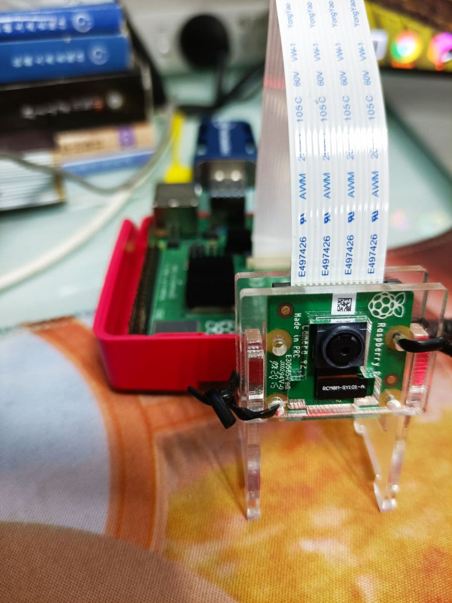
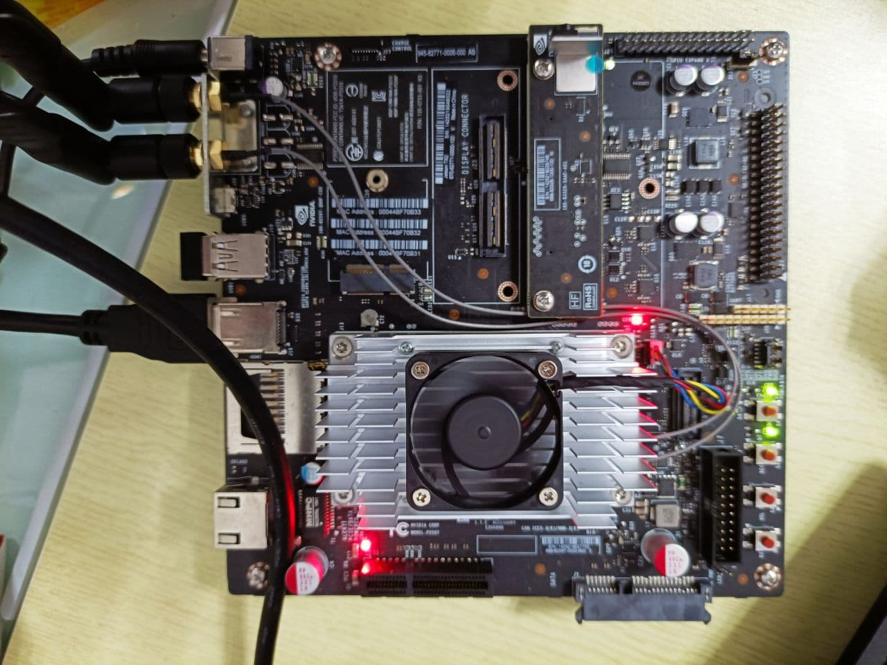

# Face Tracking

> For *Hackathon 2020 East China*  
>
> Team: Sign up soon after papapa   
> 啪的一下就报名了很快啊 团队 

### 项目简介

A simple framework of N:N face retrieval system, combined with embedded hardware to explore something about edge computing.  

本项目想完成一套 n:n 的人脸检索系统的简易框架，结合相关硬件进行边缘计算的探索，为抗击疫情提供一个人员追踪的平台。  

我们使用到的硬件有 [Jetson TX2](https://developer.nvidia.com/embedded/jetson-tx2) 以及 [树莓派4B](https://www.raspberrypi.org/products/raspberry-pi-4-model-b/) + [Intel 神经计算棒第二代（NCS2）](https://ark.intel.com/content/www/us/en/ark/products/140109/intel-neural-compute-stick-2.html)

整体的硬件平台我们分为两种方案：

1. 树莓派 + NCS2 + 外接摄像头  

2. 利用 Jetson TX2 的板载摄像头

**借鉴的开源项目：**   

- https://github.com/ageitgey/face_recognition  

- https://github.com/deepinsight/insightface  

###  开发记录

- 2020/11/28 下午 摸鱼 & 调设备，安装环境  

- 2020/11/28 23:17:12 Jetson TX2 在配环境的路上不堪重负，失去了他的全部空间

    

- 2020/11/28 23:30(?) OpenCV 编译无数次失败后，决定清理各种缓存，重新利用 pip3 编译安装  

- 2020/11/29 00:04:25 还在 Build wheel...

- 2020/11/29 01:01:58 太感人了，OpenCV 终于 build 完成安装好了

- 2020/11/29 01:10:15 程序出错 `segmentation fault(core dump)`，随后确认又是 cv2 模块的问题，心态炸了  

- 2020/11/29 01:21:35 重复测试后发现与依赖模块导入先后顺序有关，在崩溃边缘终于出图了！随后优化代码。  

- 2020/11/29 02:24(?) 重新讨论前后端方案，完善数据库及接口对接相关工作。  

- 2020/11/29 02:40:30 标注数据等，嵌入式设备数据库相关代码。 

- 2020/11/29 04:20:22 后端接口初步定型。  

- 2020/11/29 04:52:20 前后端接口联调，树莓派嵌入式设备模型优化。  

- 2020/11/29 06:56:20 docker公网部署已完成

- 2020/11/29 06:57:00 在这个不寻常的通宵日子里，我们的实验室将在11月29日7:00-12:00间停电。可以回去摸鱼睡大觉了，呼噜呼噜

### License

License: [GNU General Public License v3.0](LICENSE)

最终解释权归本项目开发者所有。   
The final interpretation right belongs to the developers of the project.

Copyright © 2020 Sign up soon after papapa 啪的一下就报名了很快啊  